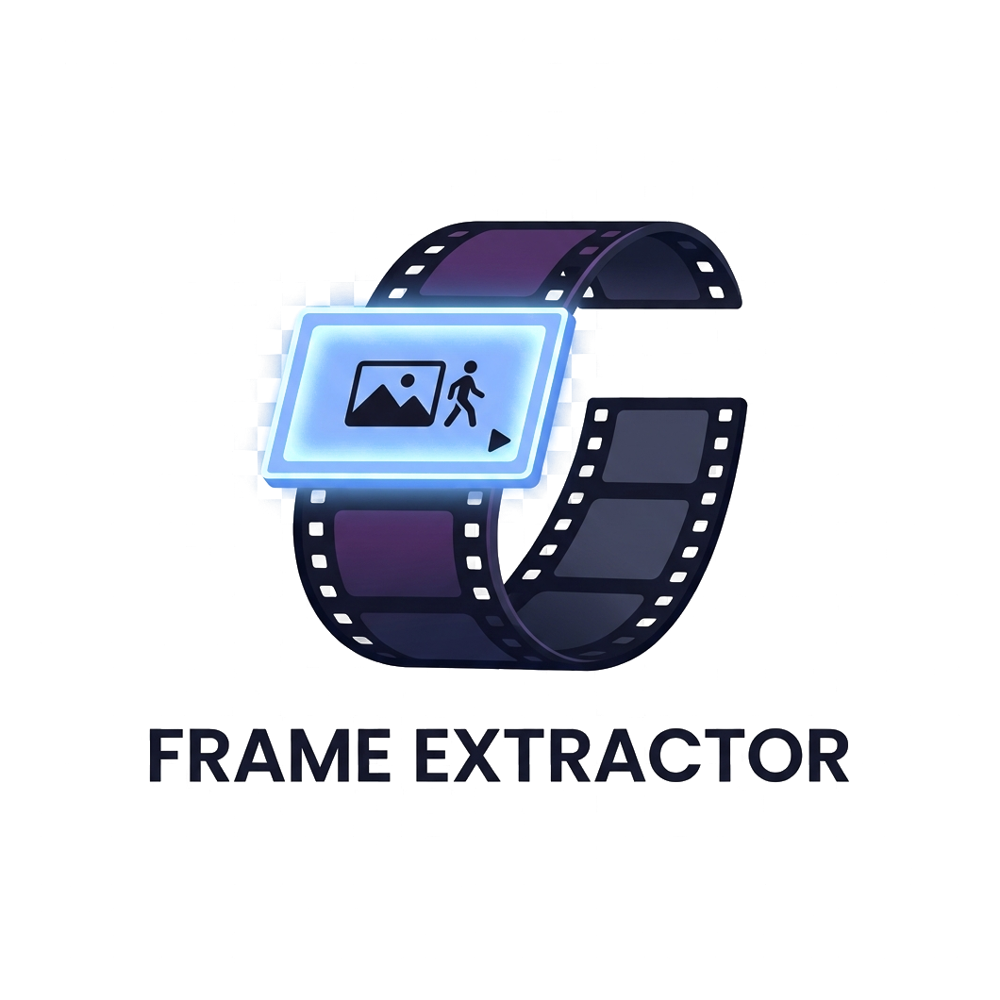

# Frame Extractor

A modern, fluid, and high-performance GUI desktop application to navigate, bookmark, and extract frames from video files with millisecond precision. Built using Python, Tkinter, and OpenCV with a sleek dark mode Catppuccin-themed interface.



## Features

- **⚡ High-Performance Playback & Seeking**: Uses a persistent background thread (`PreloadWorker`) with OpenCV stream reuse to cache neighboring frames, making frame-by-frame navigation instantaneous.
- **⏱️ Precise Navigation**: Skip frame-by-frame using arrow keys, or jump ±10 frames using `Shift + Arrow Keys`.
- **🖱️ Drag & Drop**: Simply drag and drop any video file onto the canvas to load it immediately.
- **🎞️ Dynamic Filmstrip**: Displays clickable visual thumbnails spanning the entire video timeline for quick jumps.
- **🔖 Frame Bookmarking**: Bookmark frames while exploring and export them all at once.
- **📋 Batch Extraction**: Auto-extract one frame every N frames across the whole video.
- **⚙️ Persistent Configuration**: Saves your target output directory, image format (PNG or JPG), and JPG quality settings.
- **📜 Recent History**: Quickly reopen your last 8 videos.

## Requirements

- Python 3.8 or higher
- Windows (fully tested, supports other OS with standard Tkinter)

## Installation

1. Clone this repository:
   ```bash
   git clone https://github.com/YOUR_GITHUB_USERNAME/frame-extractor.git
   cd frame-extractor
   ```

2. Install dependencies:
   ```bash
   pip install -r requirements.txt
   ```

## Usage

Run the main application script:
```bash
python main.py
```

### Keyboard Shortcuts

| Shortcut | Action |
| --- | --- |
| `Space` | Play / Pause video playback |
| `Left Arrow` | Step 1 frame backward |
| `Right Arrow` | Step 1 frame forward |
| `Shift + Left Arrow` | Jump 10 frames backward |
| `Shift + Right Arrow` | Jump 10 frames forward |
| `M` | Bookmark / Unbookmark current frame |
| `Ctrl + S` | Save current frame instantly |
| `Ctrl + O` | Open video file dialog |
| `Ctrl + E` | Open output pictures directory in Explorer |
| `Home` | Jump to the first frame |
| `End` | Jump to the last frame |

## License

This project is licensed under the MIT License.
